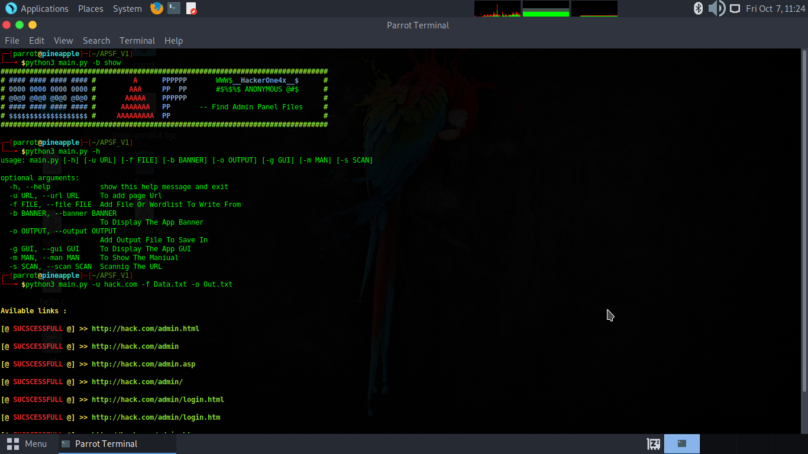
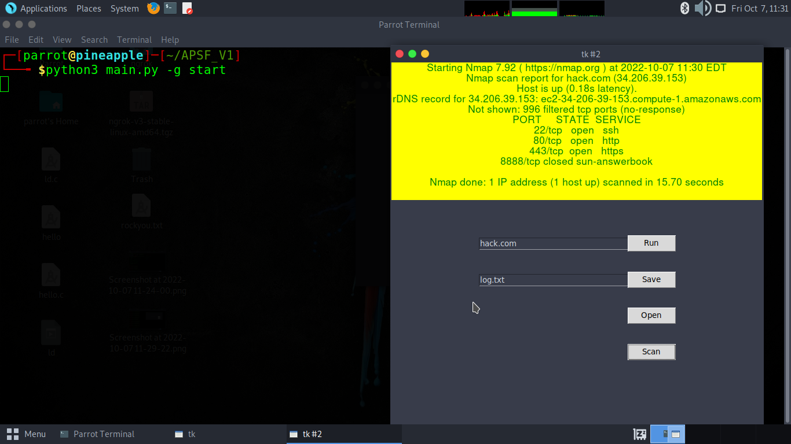
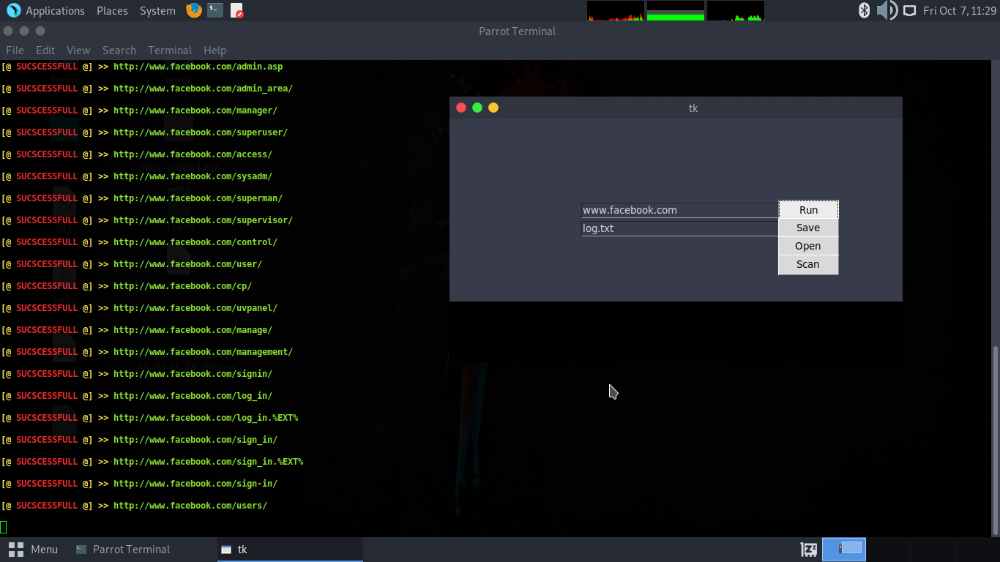

# APSF_V1 @hackerone4x Social Engneering Tool 
#### Installation :
- >     apt install python3 
- >     pip3 install -r requirements.txt
- >     apt install git 
- >     git clone https://github.com/hackerone4x/APSF_V1
- >     cd APSF_V1
- >     python3 main.py
________________________________________________________________________________________________________________________________________________ 
#### Useage :
- >     python3 main.py 
- >                 -h or --help         display commands and useage
- >                 -g or --gui   start  run gui program mode
- >                 -m or --man   help   Show help
- >                 -u or --url          Add web page domain name 
- >                 -f or --file         Add or Use Wordlist file
- >                 -o or --output       Write The Output On Text File
- >                 -s or --scan         Do A Scan On The Page , Argument is a num of Run ICMP or ping Scan
- >                 -b or --banner show  Show The Banner Of The Program
________________________________________________________________________________________________________________________________________________

 
 _______________________________________________________________________________________________________________________________________________
 
 
 _______________________________________________________________________________________________________________________________________________
 
 
